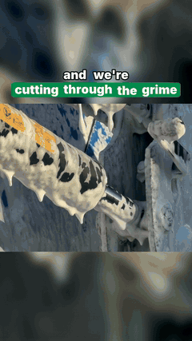

# Invokard Studio

Created by **Antonio José Bergoños (Octonove)**. The code and documentation are MIT-licensed; keep the copyright notice when you reuse them. The example media have separate rights: [MEDIA_LICENSE.md](MEDIA_LICENSE.md).

If this saves you an editing session, [buy me a Paulaner](https://www.paypal.com/donate/?business=stradoxx%40gmail.com&no_recurring=0&currency_code=EUR&item_name=Support%20Invokard%20Studio). The reel engine runs perfectly well without the beer.

**Reels that look edited, made by your coding agent.** A skill for Claude Code, Codex, Antigravity, Gemini CLI and
Cursor, plus a Python engine that composes every frame: word-by-word captions with the key word highlighted, animated
headlines and chips, charts, before/after wipes, cuts on the beat, end cards, a proper audio mix. Bring AI images and
clips from Magnific (or any provider), or the client's own footage, or just a song and its artwork.

*Lee esto en español: [README.es.md](README.es.md).*

| Client footage, cut on the beat | Illustrations + voice + chart | A song and its artwork |
|:---:|:---:|:---:|
|  |  |  |
| [Schippers New Zealand](examples/schippers/) · 31 s · 34 phone clips, no voice-over, the client's script on screen, a wipe on the logo, everything on a 115 BPM grid. Zero credits on video. | [Ekilib](examples/ekilib/) · 45 s · nine sentences of voice, thirteen illustrations in the client's style, an animated glucose card, a numbered list, a morph. | [Maemuki](examples/maemuki/) · 20 s · the chorus transcribed locally and snapped to the lyrics; a pan across the artwork. Zero credits. |

A fourth set, three prompt reels for [Simplifica con IA](examples/simplificaconia/), shows the "comment WORD" outro and
the section chips (made with the previous version of the engine; no script shipped). For the other three, the
`reel.py` that produced them ships inside the skill (`skills/invokard-studio/assets/examples/`), so agents read it
before writing their own: that file *is* the edit.

## How it works

```
   script ──▶ voice (one file per sentence) ──▶ captions timed word by word ──▶ every cut = a word time
   images (AI, with a style reference) ──▶ preview the whole edit on stills ──▶ clips only for the shots that need motion
   client clips ──▶ contact sheets ──▶ extract segments ──▶ beat grid ──▶ wipe ──▶ end card on the final hit
   song / narration ──▶ align.py (faster-whisper) ──▶ captions from timed words
                                        │
                              reel.py  ─┴─▶  reelkit: Pillow frames ──▶ ffmpeg h264 + ducked, normalised mix ──▶ out/reel.mp4 + cover
```

The agent writes `reel.py` — 60 to 150 lines that describe shots, layers, voice, effects — previews it as a contact
sheet, fixes it, and renders. The skill (`skills/invokard-studio/SKILL.md`) is the method: what to generate and in
what order, how to time, what to check, what things cost, what not to do. It was distilled from delivered client work,
not from a demo.

## Install

Requirements: Python 3.10+, ffmpeg and ffprobe on PATH ([troubleshooting](skills/invokard-studio/references/troubleshooting.md)).

```bash
git clone https://github.com/Octonove/invokard-studio.git
cd invokard-studio
pip install -r requirements.txt
python install.py            # detects Claude Code / Codex / Antigravity / Gemini CLI / Cursor / Windsurf and installs the skill for each
python install.py doctor     # ffmpeg, packages, fonts, keys (names only), agents found
```

| Agent | Where the skill goes | How to call it |
|---|---|---|
| Claude Code | `~/.claude/skills/invokard-studio` | ask for a reel; or `/invokard-studio` |
| Codex CLI / app | `~/.codex/skills/invokard-studio` and `~/.agents/skills/` | `$invokard-studio make me a 30 s reel from these clips` |
| Antigravity | `~/.gemini/config/skills/invokard-studio` | `/invokard-studio` |
| Gemini CLI | `~/.gemini/skills/invokard-studio` | `/invokard-studio` or ask |
| Cursor | `~/.cursor/skills/invokard-studio` | ask; Cursor also reads the Claude and Codex folders |
| Windsurf | `~/.codeium/windsurf/skills/invokard-studio` | ask |

`python install.py --project .` installs into the current project (`.agents/skills`, `.claude/skills`, …) so a team
shares it through git. `--link` uses a symlink/junction so edits in this repo apply at once. `--agents codex,cursor`
limits the targets. `python install.py uninstall` removes what it installed.

Optional: `pip install -r requirements-align.txt` (faster-whisper) for captions from a recorded narration or a song.

## Connect a media provider

The engine renders local media without any account. To *generate* images, clips, voice and music:

- **Magnific MCP** (recommended): add `https://mcp.magnific.com` to your agent's MCP servers and sign in in the
  browser. `.mcp.json.example` is the Claude Code snippet; `codex mcp add magnific --url https://mcp.magnific.com` for
  Codex. Gives Nano Banana Pro, Kling 3.0, Veo 3.1, ElevenLabs voices, Lyria 3 music and a cost simulator.
- **Magnific REST**: `MAGNIFIC_API_KEY` in `.env` (see `.env.example`) → `scripts/providers/magnific.py`.
- **ElevenLabs**: `ELEVENLABS_API_KEY` → `scripts/providers/elevenlabs.py`, with per-word timestamps.
- **Your own files**: photos, clips, a recorded voice, a licensed track, dropped in the work folder.

Keys stay in the environment or in `.env`, never in the chat or in scripts. Details, model choices and credit prices:
[references/providers.md](skills/invokard-studio/references/providers.md).

## First reel

Tell your agent what you have. Three prompts that work:

> Make a 30-second Instagram reel about this article. Use the invokard-studio skill. Brand colours from ref/logo.png.

> Here are 20 clips of the job in `clips/`. Build a before/after reel with this text on screen, no voice-over, cut on
> the music.

> This is a song and its cover. Make a 20-second lyric teaser of the chorus.

The agent will scaffold a work folder (`python scripts/new_reel.py`), generate or ingest the material, preview the edit
as a contact sheet (`review/preview.jpg`), render (`out/reel.mp4`, `out/cover.jpg`) and verify the file
(`media.py verify`: specs, loudness, a contact sheet from the final MP4). It will not publish anything.

## What is in the box

```
skills/invokard-studio/
  SKILL.md                     the method (Agent Skills standard; works in every agent that reads SKILL.md)
  references/                  production.md · footage.md · providers.md · api.md · troubleshooting.md
  scripts/reelkit.py           the engine: sources, layers, captions, audio mix, beat grid
  scripts/pieces.py            components: brand, headline, chips, text blocks, chart card, list items, wipe, end cards
  scripts/media.py             tools: frames, extract, contact sheets, voice spans, beats, splice, verify, web, gif…
  scripts/align.py             word timings from any audio (faster-whisper), snapped to the real text
  scripts/providers/           magnific.py · elevenlabs.py · costs.py · env.py
  scripts/new_reel.py          scaffolds a work folder + reel.py from template_reel.py
  assets/fonts/ · assets/sfx/  Inter, Playfair Display (OFL); eight sound effects
  assets/examples/             schippers · ekilib · maemuki: the reel.py of each delivered reel
examples/                      the same three plus simplificaconia: 720p copies, gifs, covers, notes
install.py                     install / doctor / uninstall
tests/                         engine and installer tests (pytest; no credits, no keys)
```

Run the tests with `python -m pytest tests -q` (needs ffmpeg).

## Design notes

- **Everything on screen is set by the engine.** Images are generated without text; type, boxes, captions and
  animation are composed at render time, so they are sharp and exactly timed, and a brand change is one line.
- **Timing comes from audio, not from eyes.** One voice file per sentence gives the engine the pauses; captions and
  cuts derive from them. With a recorded narration or a song, `align.py` gives the words.
- **Preview before spending.** The edit is built and reviewed on still images; clips are generated last, only for the
  shots that need motion, after a cost estimate.
- **Real footage is a first-class input.** Landscape clips are fitted over their own blur, segments come from contact
  sheets, and cuts sit on a beat grid measured from the track.
- **The mix is done.** Sidechain ducking under the voice, −14 LUFS, true-peak limiter; sound effects on the cuts.

## Status

Public release, version 1.0.0. Built and verified on Windows 11 with Python 3.14 and ffmpeg 8; the code has no
platform-specific paths (fonts are bundled, system fonts are fallbacks), but macOS and Linux have not been exercised
yet. The 0.x TypeScript plugin for Codex is preserved under the tag `v0.2.0-codex`.

Licence: MIT for code and documentation ([LICENSE](LICENSE)); example media are display-only under [separate terms](MEDIA_LICENSE.md). Fonts are OFL.
